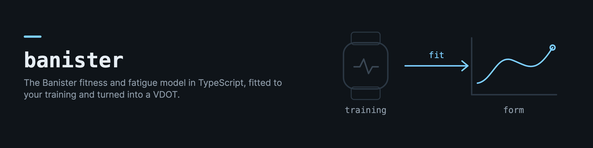

# banister

Training-model core in TypeScript for the [soma](https://github.com/drkostas/soma) ecosystem. Ported from soma's Python `training_engine` and verified against it with golden fixtures.

## Modules

**Banister fitness-fatigue model** — `p(t) = p0 + k1·Σ load·e^(-(t-i)/tau1) - k2·Σ load·e^(-(t-i)/tau2)`
- `banisterPredict(params, dailyLoads, targetDay)` — predict performance (VDOT).
- `fitBanister(dailyLoads, anchors)` — differential-evolution fit + Nelder-Mead polish, recency-weighted anchors. Reaches scipy-quality WSSE (1.9034 vs scipy 1.9227 on real training data).

**Daniels/Gilbert VDOT** — `vdotFromRace`, `allPaces`, `hmGoalPaces`, `timeFromVdot`, `velocityAtVo2max`, `adjustVdotForWeight`. Pace ints match Python's rounding exactly.

**Personal calibration** — 4-phase readiness-weight progression: `getCurrentPhase`, `computeCorrelations`, `getActiveWeights` (equal → |Pearson r| → LASSO). LASSO weights are computed in the consumer layer and passed in.

## The training engine (0.5.0)

The rest of soma's training engine, moved here so the web, the app and the pipeline run one implementation:

- `adjust.ts`: `readinessFactorCalc`, `fatigueFactorCalc`, `computeAdjustedPace`, `adjustStepTargets` (the merge step: readiness and fatigue turn a base pace into today's pace, and each step's targets follow).
- `forward-simulation.ts`: `runForwardSimulation`, the day-by-day projection a trajectory chart draws (VDOT, TSB, readiness, adjusted paces, HM prediction). Its input day type is exported as `SimulationPlanDay`.
- `plan-generator.ts`: the half-marathon plan builder (`generatePlan`) and its per-workout step builders.
- `fitness-stream.ts` (efficiency factor, decoupling, VO2max extraction, lap aggregation), `readiness-stream.ts` (`zScore`, `computeReadiness`), `strength-load.ts` (1RM, RPE, running relevance, strength load), `body-comp.ts` (weight EMA), `weight-trend.ts`, `readiness.ts` (`readinessScore`), `freshness.ts` (is an observation still current), `dates.ts`.

Pure functions only, checked against the Python goldens. Reading the tables and storing the results stay with the application.

## Install
```
npm install banister
```

## Projection, pace zones and the PMC

Three modules that used to live as local copies in soma's web app (soma#835):

- `projection.ts`: `projectVdotSeries`, `projectFitnessOnlySeries`, `projectVdotAt` project a VDOT time-series over calendar dates from `DatedLoad[]` (`{ date, load }`) with the shared `BanisterParams`. `DEFAULT_BANISTER` is the projection default.
- `pace-zones.ts`: the Daniels VDOT table (35 to 60) with `getBasePace(vdot, runType)`, `getHRZone(runType)` and `getHMPrediction(vdot)`; run types map to zones through `RUN_TYPE_TO_ZONE`.
- `pmc.ts`: `computeActivityLoad`, `computeTrimp`, `computePmc` (EWMA CTL/ATL/TSB, tau 42/7) and `crossModalScale`, checked against the Python load-stream golden in `tests/pmc_golden.json`.

All of it is pure. Reading activities and storing the curve stay with the application that owns the tables.

Also in the package since 0.4.0: `pacesForVdot(vdot)` (the interpolated pace set from the table) and `hmPace(paces)`; `hmSecondsFromVdot(vdot)` and `vdotFromHmSeconds(seconds)` over the Daniels equations; and `format.ts` with `paceStr` (sec/km to "M:SS") and `timeStr` (seconds to "H:MM:SS" or "M:SS"), so the web and the app print the same strings for the same numbers.

## Anchors and the daily load series (0.6.0)

- `detectAnchorRuns(runs, estimatedHrmax, hrThresholdPct?, minDistanceM?)` picks the hard runs the Banister fit anchors to (at least 90% of HRmax over at least 2 km by default), each with the VDOT its distance and time imply.
- `dailyLoadSeries(records)` builds the daily series the PMC and the fit both read. Each record is scaled by `crossModalScale` for its source, summed per day, and every rest day between the first and the last record is 0.
- `computeWeightEma(weights, span, digits)` takes `digits = null` to keep full precision, for a caller that rounds its own display.

Changes are listed in [the CHANGELOG](https://github.com/drkostas/banister/blob/main/typescript/CHANGELOG.md). MIT licensed.
